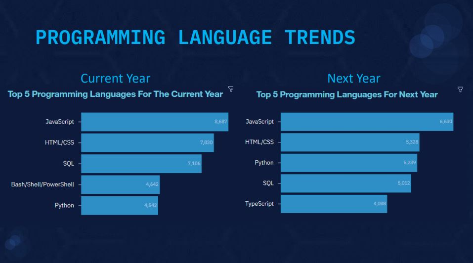
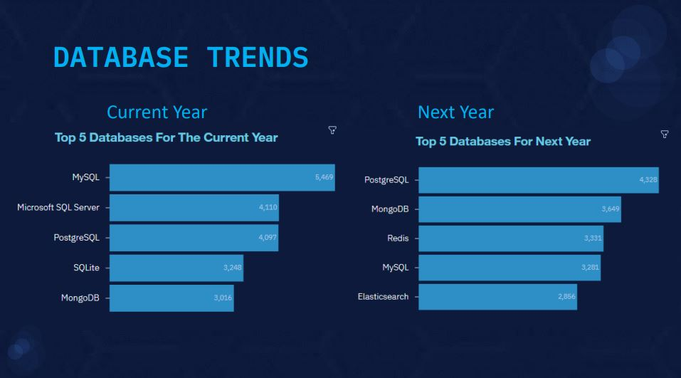
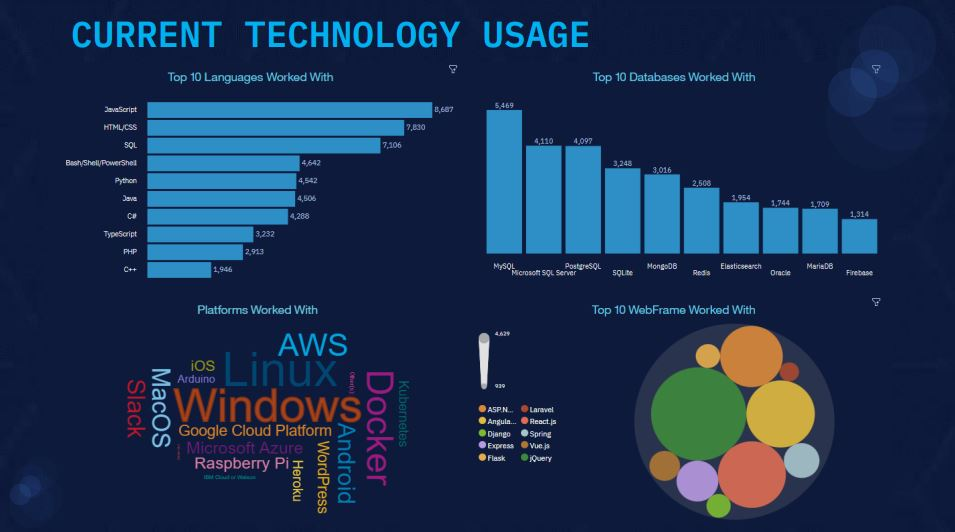
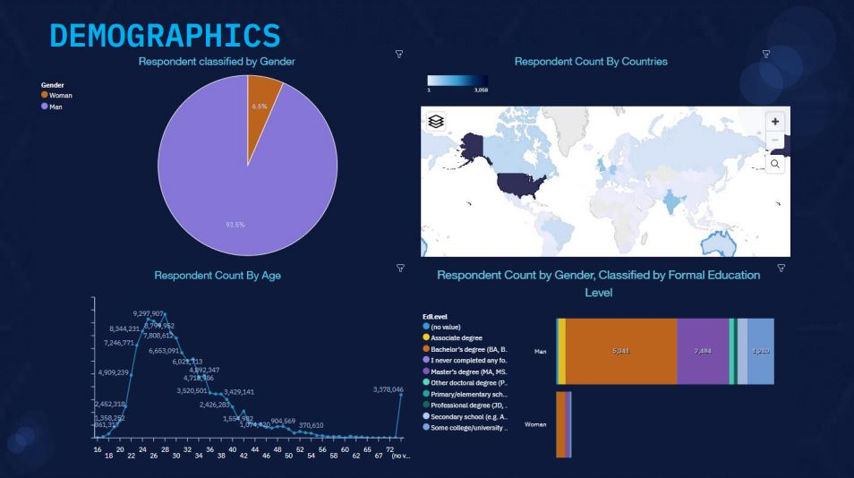
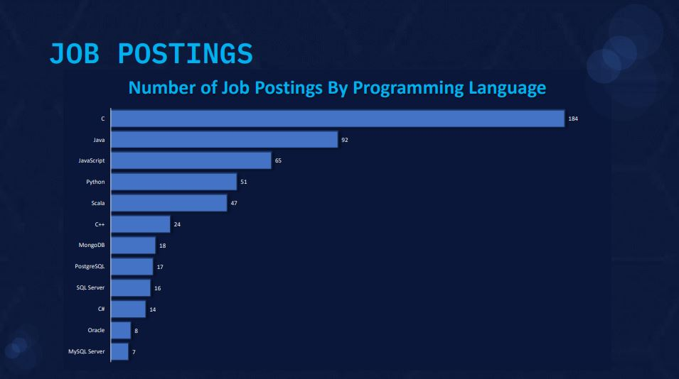
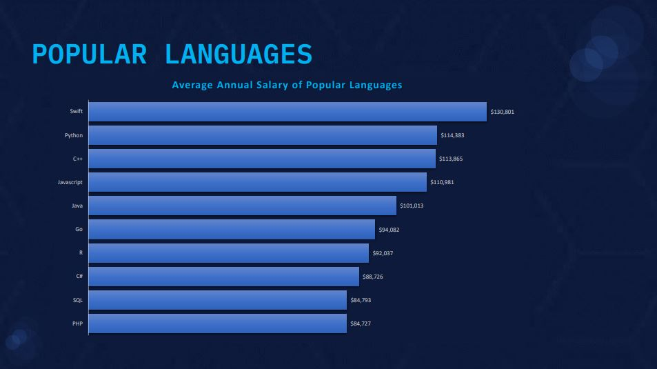

# 2019 STACK OVERFLOW DEVELOPER SURVEY
## AGU, JAMES IFEANYICHUKWU
### JULY 2022

## OUTLINE

• Executive Summary

• Introduction

• Methodology

• Explanatory Analysis

    • Visualization – Charts

    • Dashboard

    • Findings & Implications

• Conclusion

• Appendix

### EXECUTIVE SUMMARY

• A number of relevant skills are in-demand in the Tech space and this demand has increased over the years.

• Due to this growing demand, it is important to always analyze alongside the current trend, the likely future trend of those skills.

▪ This is to enable Tech Industries spot relevant opportunities and make informed decisions as it relates to cost and budget inclusions.

• Survey of the demographics for different technologies.

• Age and Gender bias in the technology sector.

### INTRODUCTION

• This presentation is aimed at gaining insights on the future skill requirements and platforms in the technology space and their impact on the growing competitive trend.

• The presentation is also targeted at Global IT Industry Leaders, Programmers, and Students, to enable them spot the possible relevant skills which will help them make informed decisions on budget, learning/training cost, and personnel management.

• The analysis will cut across various aspects of the Tech Space, and positive conclusions will be drawn afterwards.

### METHODOLOGY

▪ Data Collection (Web-Scraping):

> Stack overflow developer 2019 survey1
> GitHub job postings2
> Programming languages annual salary3

▪ Data Wrangling:

- Checking for quality and tidiness issues.
- Data Cleaning
- Handling missing data, normalization, and checking for datatype consistency.

▪ Exploratory Data Analysis

▪ Assessing the distribution of the datasets, presence of outliers, and correlation between columns.

▪ Data Visualization (tools):

> Python Matplotlib & Seaborn

> IBM Cognos Dashboard

> Presentation of Results

## EXPLANATORY ANALYSIS

**Snapshot of the Dataset used for the analysis**

### PROGRAMMING LANGUAGE TRENDS - FINDINGS & IMPLICATIONS

#### FINDINGS

• JavaScript and HTML/CSS are the most popular programming languages. This means that Web development is still in high demand.

• Python gained more popularity over time. This could be due to more interest in Data Science and Artificial Intelligence

• The demand for SQL dropped significantly.

#### IMPLICATIONS

• Due to the high demand in Web Development, more personnel should be hired for the JavaScript and HTML/CSS skills

• The growing interest in AI and Machine Learning suggests that Python will gain more significance and popularity in the coming years.

### DATABASE TRENDS

### DATABASE TRENDS - FINDINGS & IMPLICATIONS

#### FINDINGS

• There was a significant drop in the popularity of MySQL.

• PostgreSQL gained a very significant popularity and has become the most widely used Database tool, followed by MongoDB

#### IMPLICATIONS

• The vast advantages of NonRelational Database Systems have contributed to the popularity of MongoDB and Redis.

• PostgreSQL has gained more popularity due to its Open Source platform.

#### CURRENT TECHNOLOGY USAGE

#### FUTURE TECHNOLOGY TREND

#### DEMOGRAPHICS

#### OVERALL FINDINGS & IMPLICATIONS

#### FINDINGS
• Platform – Linux and Windows remain the most desired platforms.

• Web Frameworks – React.js and Vue.js have increased in popularity while interests in jQuery have dropped significantly.

• JavaScript and PostgreSQL remain the most popular Programming Language and Database tool respectively.

• More Male than Female are in the Tech Space. This could be a sign of gender discrimination.

• USA ranks highest in the Technology space.

• Majority of the Tech experts fall within the age of 15 and 42 years.

#### IMPLICATIONS

• Equal opportunities should be given to both genders in the Tech space.

• Age shouldn’t necessarily be a barrier when venturing into Tech.

• There is need to expose the trend in Technology to more countries and they should all have equal opportunity to participate.

• The trend in Technology is ever changing, and every programmer, regardless of their domain should be open-minded and flexible enough to adapt to these changes.

## CONCLUSION

1. The trend in Technology is constantly changing. As a result, quality Personnel management is key to ensuring adequate upskilling for more demanding skills and growing trends.

2. The Tech Space should be accommodating regardless of Age, Gender, and Location. 

3. Adequate Budgeting plan is vital in ensuring resources are channeled to the right skill for improved performance. 

[Click to View the Interactive Dashboard on IBM Cognos](https://eu-gb.dataplatform.cloud.ibm.com/dashboards/6aae7a67-e543-4bbb-9f9d-e64ec6eff71d/view/7c1be41e3eb915de7ceeeae4079024032932245ee3bb840285817b495a622797a93d4792c87b4b53dc420131f7eb16509d "@embed")