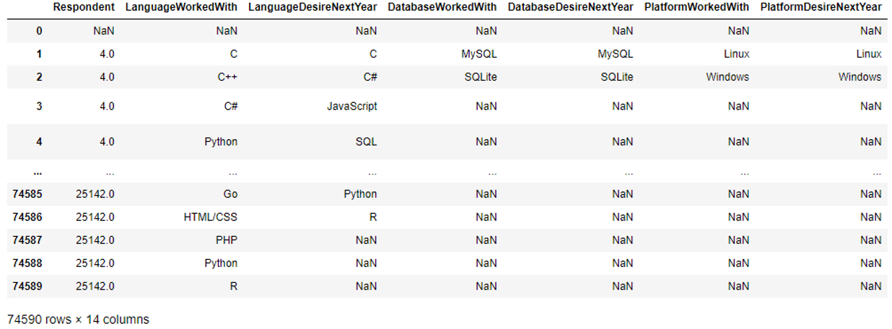
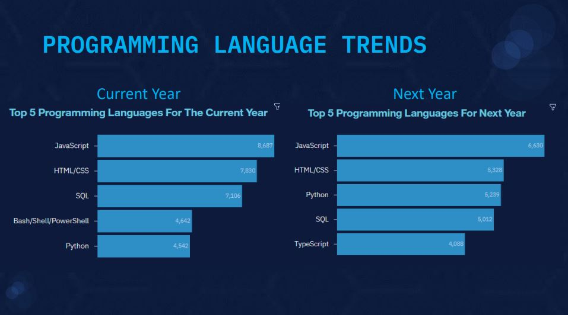

# 2019 STACK OVERFLOW DEVELOPER SURVEY
## AGU, JAMES IFEANYICHUKWU
### JULY 2022

## OUTLINE

• Executive Summary

• Introduction

• Methodology

• Results

• Visualization – Charts

• Dashboard

• Discussion

• Findings & Implications

• Conclusion

• Appendix

### EXECUTIVE SUMMARY

• A number of relevant skills are in-demand in the Tech space and this demand has increased over the years.

• Due to this growing demand, it is important to always analyze alongside the current trend, the likely future trend of those skills.

▪ This is to enable Tech Industries spot relevant opportunities and make informed decisions as it relates to cost and budget inclusions.

• Survey of the demographics for different technologies.

• Age and Gender bias in the technology sector.

### INTRODUCTION

• This presentation is aimed at gaining insights on the future skill requirements and platforms in the technology space and their impact on the growing competitive trend.

• The presentation is also targeted at Global IT Industry Leaders, Programmers, and Students, to enable them spot the possible relevant skills which will help them make informed decisions on budget, learning/training cost, and personnel management.

• The analysis will cut across various aspects of the Tech Space, and positive conclusions will be drawn afterwards.

### METHODOLOGY

▪ Data Collection (Web-Scraping):

> Stack overflow developer 2019 survey1
> GitHub job postings2
> Programming languages annual salary3

▪ Data Wrangling:

> Checking for quality and tidiness issues.

> Data Cleaning

> Handling missing data, normalization, and checking for datatype consistency.

▪ Exploratory Data Analysis

▪ Assessing the distribution of the datasets, presence of outliers, and correlation between columns.

▪ Data Visualization (tools):

> Python Matplotlib & Seaborn

> IBM Cognos Dashboard

> Presentation of Results

### RESULTS
#### Snapshot of the Dataset

### PROGRAMMING LANGUAGE TRENDS - FINDINGS & IMPLICATIONS

#### FINDINGS

• JavaScript and HTML/CSS are the most popular programming languages. This means that Web development is still in high demand.

• Python gained more popularity over time. This could be due to more interest in Data Science and Artificial Intelligence

• The demand for SQL dropped significantly.

#### IMPLICATIONS

• Due to the high demand in Web Development, more personnel should be hired for the JavaScript and HTML/CSS skills

• The growing interest in AI and Machine Learning suggests that Python will gain more significance and popularity in the coming years.

